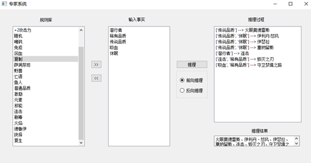
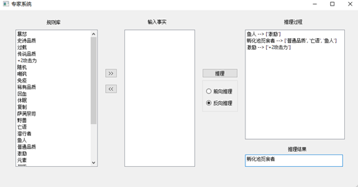

# 人工智能导论 实验

> Author: LinJ    update_time: 2021/04/14

- 专家系统
- `A*`解八数码问题

## Recognition-system

### 实验内容

设计并编程实现一个小型产生式系统（如分类、诊断等类型）

### 文件结构

- main.py  入口文件

- ui使用`QT Designer`打开`main.ui`进行修改

### 输出

#### 前向推理

1. 将初始事实，放入综合数据库
2. 推理：将综合数据库与规则库中的已知规则进行匹配。所谓匹配是指把规则的前提条件与综合数据库中的已知事实进行比较，若两者一致或某条规则的前提被综合数据库中的条件全部包含，则为匹配成功
3. 若匹配成功，将匹配到的规则的结论，加入到综合数据库中，再进行匹配
4. 若匹配失败，则继续匹配



#### 反向推理

1. 将初始事实放入综合数据库
2. 将综合数据库与规则库中的事实进行匹配。若匹配成功，将该规则中的条件置入综合数据库，回溯后进行匹配。



## Eight-puzzle

### 实验内容：

以8数码问题和16数码问题为例，实现A*算法的求解程序，要求设计两种不同的估价函数。

### 估价函数

通过修改`grid`类的`update()函数中的self.h`

- 不在位个数
- 曼哈顿距离

### 输出

```
-----------------
     Step 01
-----------------
2 1 3
7 0 4
8 6 5
-----------------
     Step 02
-----------------
2 1 3
0 7 4
8 6 5
-----------------
     Step 03
-----------------
0 1 3
2 7 4
8 6 5
-----------------
     Step 04
-----------------
1 0 3
2 7 4
8 6 5
-----------------
     Step 05
-----------------
1 3 0
2 7 4
8 6 5
-----------------
     Step 06
-----------------
1 3 4
2 7 0
8 6 5
-----------------
     Step 07
-----------------
1 3 4
2 7 5
8 6 0
-----------------
     Step 08
-----------------
1 3 4
2 7 5
8 0 6
-----------------
     Step 09
-----------------
1 3 4
2 0 5
8 7 6
-----------------
     Step 10
-----------------
1 3 4
0 2 5
8 7 6
-----------------
     Step 11
-----------------
1 3 4
8 2 5
0 7 6
-----------------
     Step 12
-----------------
8 2 4
7 6 5
-----------------
     Step 17
-----------------
1 2 3
8 0 4
7 6 5
time: 2.0898773670196533
expandCount:  1003
newCount:  1730
```


